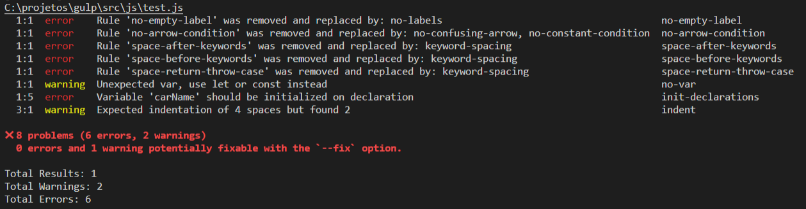
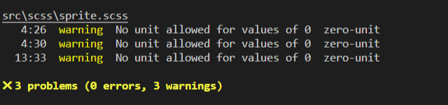

# DESCRIPTION

This is a default project using Gulp 4. For better development performance, some processing libraries are already configured for me. Make the modifications to better serve you.

### REQUIREMENTS

[nodejs](https://nodejs.org/en/download/) [yarn](https://classic.yarnpkg.com/en/docs/install/#windows-stable)

### INSTALLATION

Use the package manager npm or yarn.

```bash
npm install --global gulp-cli

yarn install
# or
npm install
```

### GULP 4
1 - The package.json file contains all used libraries.

2 - The __gulp__ folder has all tasks. If you need to change or add new tasks, do it here.

3 - The __src__ folder has all files to be compiled.

4 - The __assets__ folder is the directory where the compiled files will be saved.

5 - The __Gulpfile.js__ file has registered tasks.

### LINTERS

###### __ESLINT__ [gulp-eslint](https://github.com/adametry/gulp-eslint#readme)

The ESLINT settings are being provided by the __.eslintrc.js__ file.

```js
const eslint = require('./gulp/eslint');
/*
eslint (
  #1 Source js files
);
*/
exports.eslint = eslint(...);
//use
gulp eslint
```
output:



###### __SASSLINT__ [gulp-sass-lint](https://github.com/sasstools/gulp-sass-lint#readme)

The SASSLINT settings are being provided by the __.scss-lint.yml__ file.

```js
const scsslint = require('./gulp/scsslint');
/*
scsslint (
  #1 Source js files
);
*/
exports.scsslint = scsslint(...);
//use
gulp scsslint
```

output:



### ICON FONT

###### __ICON FONT__ [gulp-iconfont](https://github.com/nfroidure/gulp-iconfont)

```js
const iconfont = require('./gulp/iconfont');
/*
iconfont (
  #1 Dource files,
  #2 Dist fonts,
  #3 Source template generate pewview,
  #4 Scss dist
  #5 Relative path to use in src: url(#5/font.{ttf,svg.woff...})
);
*/
exports.iconfont = iconfont(...);
//use
gulp iconfont
```

In the __gulp / iconfont.js__ file you will find all settings for generating the icon font.

In the __src / templates / font-icon.template__ file you can configure the scss output.

The icon source is pre-defined for 'ttf', 'eot', 'woff', 'woff2', 'svg'.

The font name is pre-defined for "Icons". To modify, look for the variable FONT_NAME in the file __gulp / iconfont.js__.

###### __ICON FONT CSS__ [gulp-iconfont-css](https://github.com/backflip/gulp-iconfont-css#readme)

```js
const iconfontcss = require('./gulp/iconfontcss');
/*
iconfont (
  #1 Source files,
  #2 Dist fonts
);
*/
exports.iconfontcss = iconfontcss(...);
//use
gulp iconfontcss
```

The __gulp / iconfontcss.js__ task will compile scss to css.

The __gulp / template.js__ task will compile an html page to preview the icons.

To preview, visit __assets / preview-icon-fonts.html__

### JS

###### __SOURCEMAPS__ [gulp-sourcemaps](https://github.com/gulp-sourcemaps/gulp-sourcemaps#readme)

###### __BABEL__ [gulp-babel](https://github.com/babel/gulp-babel#readme)

###### __UGLIFY__ [gulp-uglify](https://github.com/terinjokes/gulp-uglify#readme)
```js
const js = require('./gulp/js');
/*
js (
  #1 Source files,
  #2 Dist fonts
);
*/
exports.js = js(...);
//use
gulp js
```

### JS CONCAT

###### __CONCAT__ [gulp-concat](https://github.com/gulp-community/gulp-concat#readme)

```js
const jsconcat = require('./gulp/jsconcat');
/*
jsconcat (
  #1 Source files,
  #2 Dist
);
*/
exports.jsconcat = jsconcat(...);
//use
gulp jsconcat
```

### SCSS

###### __SOURCEMAPS__ [gulp-sourcemaps](https://github.com/gulp-sourcemaps/gulp-sourcemaps#readme)

###### __SASS__ [gulp-sass](https://github.com/dlmanning/gulp-sass#readme)

```js
const scss = require('./gulp/scss');
/*
scss (
  #1 Source files,
  #2 Dist fonts
);
*/
exports.scss = scss(...);
//use
gulp scss
```

### IMAGEMIN

###### __IMAGEMIN__ [gulp-imagemin](https://github.com/sindresorhus/gulp-imagemin#readme)

```js
const imagemin = require('./gulp/imagemin');
/*
imagemin (
  #1 Source files,
  #2 Dist
);
*/
exports.imagemin = imagemin(...);
//use
gulp imagemin
```
### TEMPLATE

###### __TEMPLATE__ [gulp-template](https://github.com/sindresorhus/gulp-template#readme)

```js
const template = require('./gulp/template');
/*
template (
  #1 Source files,
  #2 Dist
);
*/
exports.template = template(...);
//use
gulp template
```

### SPRITE

###### __SPRITESMITH__ [gulp.spritesmith](https://github.com/twolfson/gulp.spritesmith#readme)

```js
const sprite = require('./gulp/sprite');
/*
sprite (
  #1 Source sprite icons,
  #2 Dist scss,
  #3 Dist image
);
*/
exports.sprite = sprite(...);
//use
gulp sprite
```
### WATCH
The task watch is responsible for listening to the files and running the compilers automatically.

```js
exports.watch = () => {
  // Add your watch here
  watch('./src/**/*', task);
  // or
  watch('./src/**/*', series(task, task2, task3));
  // or
  watch('./src/**/*', parallel(task, task2, task3));
}
//use
gulp watch
```

### DEFAULT

The default task runs to compile the files and listen to the changes at the end.

```js
exports.default = parallel(
  series(
    series(
      exports.iconfont,
      exports.iconfontcss,
      exports.sprite,
      exports.imagemin
    ),
    parallel(
      exports.scss,
      exports.scssbuild
    )
  ),
  exports.template,
  parallel(
    exports.js,
    exports.jsbuild
  )
);
//use
gulp
```
